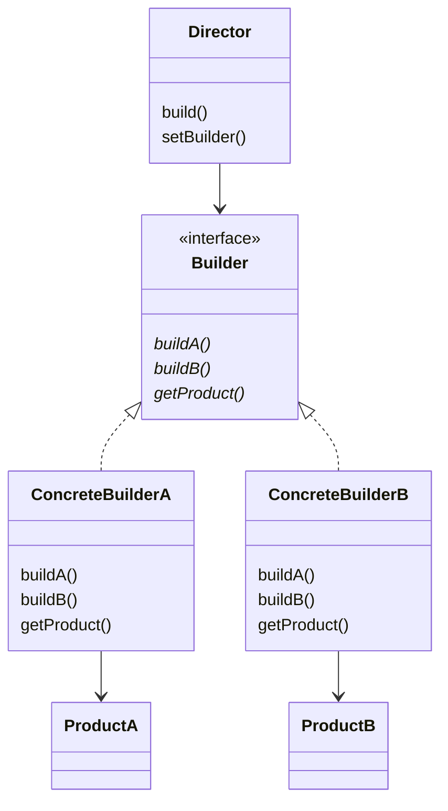

```mermaid
  classDiagram    
    class Director {
      build()
      setBuilder()
    }

    class Builder {
       buildA()*
       buildB()*
       getProduct()*
    } 
    
    class ConcreteBuilderA {
       buildA()
       buildB()
       getProduct()
    }
    
    class ConcreteBuilderB {
       buildA()
       buildB()
       getProduct()
    }

    class ProductA {
    }

    class ProductB {
    }
    
    <<interface>> Builder

    Director --> Builder
    Builder <|.. ConcreteBuilderA
    Builder <|.. ConcreteBuilderB    
    ConcreteBuilderA --> ProductA
    ConcreteBuilderB --> ProductB     
```
