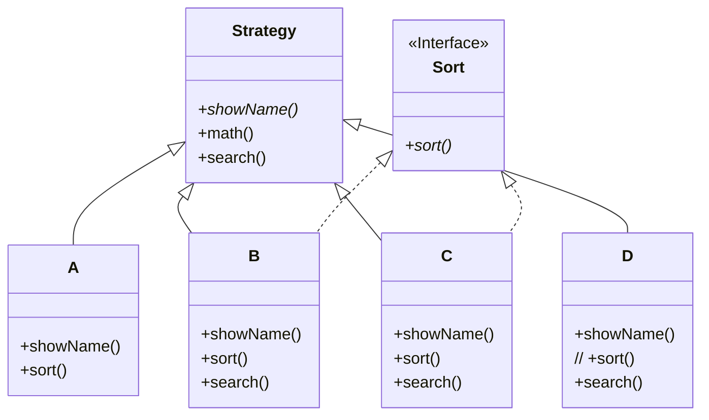

```mermaid
  classDiagram    
    class Strategy { 
      +showName()*
      +math()
      +search()
    }
    class A { 
      +showName()
      +sort()
    }
    class B { 
      +showName()
      +sort()
      +search()
    }
    class C { 
      +showName()
      +sort()
      +search()
    }
    class D { 
      +showName()
      // +sort()
      +search()
    }
    
    class Sort {
      +sort()*
    }

    <<Interface>> Sort

    Strategy <|-- A
    Strategy <|-- B    
    Strategy <|-- C
    Strategy <|-- D    
    
    Sort <|.. B    
    Sort <|.. C
```
