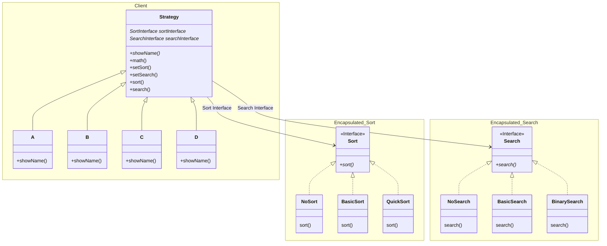

```mermaid
  classDiagram    
    namespace Client {
      class Strategy { 
        SortInterface sortInterface*
        SearchInterface searchInterface*
        +showName()*
        +math()
        +setSort()
        +setSearch()
        +sort()
        +search()
      }
      class A { 
        +showName()
      }
      class B { 
        +showName()
      }
      class C { 
        +showName()
      }
      class D { 
        +showName()
      }
    }
    namespace Encapsulated_Sort {
      class Sort {
        +sort()*
      }
      class NoSort {
        sort()
      }
      class BasicSort {
        sort()
      }
      class Quick Sort {
        sort()
      }
    }
    namespace Encapsulated_Search {
      class Search {
        +search()*
      }
      class NoSearch {
        search()
      }
      class BasicSearch {
        search()
      }
      class BinarySearch {
        search()
      }
    }
    


    <<Interface>> Sort
    <<Interface>> Search
    
    Strategy <|-- A
    Strategy <|-- B    
    Strategy <|-- C
    Strategy <|-- D    
    
    Strategy --> Sort :  Sort Interface 
    Strategy --> Search : Search Interface 

    Sort <|.. NoSort 
    Sort <|.. BasicSort 
    Sort <|.. QuickSort

    Search <|.. NoSearch 
    Search <|.. BasicSearch 
    Search <|.. BinarySearch
    
```
